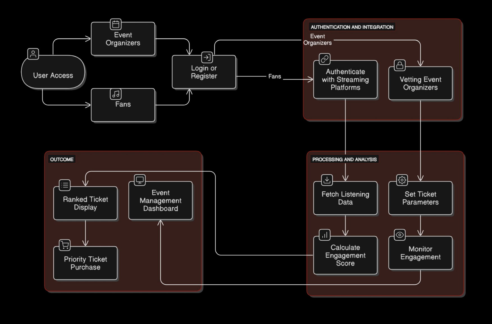

# 🎟️ CodeBlooded

**A fan-first concert ticketing platform**  
_Developed by:_ Ranjodh Singh, Naman Singh, Nikhil Kumar

## 🚨 Problem Statement

The current ticketing ecosystem is broken. Bots and scalpers dominate sales, leaving true fans behind.

- Tickets for popular artists are sold out within minutes due to scalping.
- Genuine fans often miss the chance to experience their favorite artists live.
- Scalpers inflate resale prices, making concerts unaffordable.
- Existing systems reward speed, not loyalty.

## ✅ Proposed Solution

**Fan-Prioritized Ticketing:**  
A system that integrates with streaming services (Spotify, Apple Music) to assess fan engagement and reserve a portion of tickets exclusively for loyal listeners. This dual sales model supports both priority and general ticket allocation, reducing scalper advantages.

- **Engagement-Based Ranking:** Verifies and ranks users using streaming data.
- **Reserved Ticket Pool:** Guarantees a set number of tickets for top fans.
- **Scalper & Bot Prevention:** Implements strict account linking limits and verification.

## 🚀 Key Features

- **Streaming Account Integration**: Connect Spotify, Apple Music, etc.
- **Priority-Based Ticket Allocation**: Dedicated ticket pool for top fans.
- **Artist & Event Integration**: Organizers can customize allocation logic.
- **Scalper & Bot Prevention**: Account linking limits and verification layers.
- **Location-Based Suggestions**: Personalized alerts for nearby events.

## 🛠️ Tech Stack

### Frontend
- React + Byte
- Tailwind CSS
- TypeScript

### Backend
- Node.js + Express.js
- MongoDB
- OAuth 2.0 Authentication

### APIs & Integrations
- Spotify Web API
- Apple Music API
- YouTube Data API v3

## 👥 Target Audience & Engagement

### Music Fans
- Active listeners seeking a fair chance at live events with personalized dashboards and timely notifications.

### Event Organizers
- Promoters and venues who want to ensure that tickets are distributed to genuine fans while reducing scalping.

## 🔮Future Enhancements

- **Extended Streaming & Social Media Integration:**  
  Incorporate more platforms for a broader view of fan engagement.
  
- **AI & Analytics:**  
  Use predictive analytics to optimize ticket allocation and forecast fan behavior.
  
- **Blockchain-Based Ticketing:**  
  Enhance security, transparency, and the resale market with decentralized technologies.
  
- **Market Diversification:**  
  Expand the model to sports, theater, and festivals.
  
- **Community & Loyalty Programs:**  
  Develop exclusive content, rewards, and community features to further engage loyal fans.

## 🗺️ Workflow

